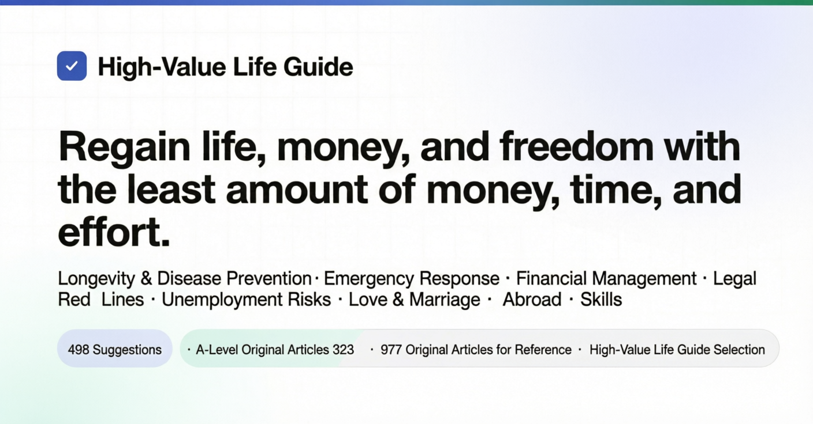

<div align="center">



# High ROI Life Guide

Covers longevity and disease prevention, emergencies and first aid, saving money and finance, legal pitfalls, unemployment and work injury, social security, dating and marriage, pregnancy and child-rearing, entrepreneurship and platform compliance, travel abroad and skills.  
498 tips, each stating what you spend (money/time/energy/willpower) and what you get back (reduction in mortality, specific cause-of-death decrease, time and energy saved, money saved, personal freedom gained), with evidence level and original source cited. Only original sources (journal papers and official reports) are cited.

[](https://MixasV.github.io/HowToLiveBetter/)
[](#table-of-contents)
[](#evidence-levels)
[](docs/verification_log/)
[](LICENSE)

**[Open Online Search Page](https://MixasV.github.io/HowToLiveBetter/)** · [Table of Contents](#table-of-contents) · [Glossary](#glossary) · [Verification Log](docs/verification_log/) · [Is Marriage Worth It (Long Form)](docs/is-marriage-worth-it.md) · [Home Emergency Kit (Long Form)](docs/home-emergency-kit.md) · [Should You Stop for Strangers in Trouble (Long Form)](docs/strangers-trouble.md) · [What Permits Do You Need for a Website or Platform (Long Form)](docs/platform-permits.md)

</div>

---

## What This Book Answers

| Question | See |
| --- | --- |
| What things that almost cost nothing can significantly lower the chance of dying young? | [1. Don't Die Young](book/01-dont-die-young.md) |
| How much do smoking, drinking, sitting, and staying up late shorten your life? | [2. Don't Die Slow](book/02-dont-die-slow.md) |
| Energy runs out every day, always interrupted — how to fix? | [3. Don't Waste Mental Energy](book/03-dont-waste-mental-energy.md) |
| Time goes where, and how to do fewer useless things? | [4. Don't Waste Time](book/04-dont-waste-time.md) |
| How to invest savings so they aren't eaten by interest, fees, and scams? | [5. Don't Waste Money](book/05-dont-waste-money.md) |
| Which health supplements, checkup packages, and "stupid taxes" can you skip? | [6. Antilist](book/06-antilist.md) |
| Unemployed, unpaid wages, broke — what can you claim and where to ask? | [7. How to Survive When Broke](book/07-how-to-survive-when-broke.md) |
| Couple's money, pre-marital property, big transfers during dating — who legally owns what? | [8. Legal and Property Safety](book/08-dont-put-yourself-at-risk.md) |
| Someone files a false report against you, fabricates facts to report — first step? Can you pursue and claim compensation later? | [8. Legal and Property Safety](book/08-dont-put-yourself-at-risk.md) |
| What part-time jobs and casual actions turn ordinary people into criminal defendants? | [9. Legal Red Lines for Ordinary People](book/09-common-legal-pitfalls.md) |
| Broad vs. focused approach to dating, can long-distance work, documents needed for marriage registration? | [10. Love and Marriage: Worth It?](book/10-love-and-marriage-worth-it.md) |
| What code you write and what jobs you take could get you convicted? | [11. Legal Red Lines for Tech Workers](book/11-tech-workers-common-pitfalls.md) |
| Starting a business — what should you think about first? | [12. Entrepreneurship and Business](book/12-entrepreneurship-and-business.md) |
| Someone collapses — what to do first? | [13. Emergencies](book/13-emergencies.md) |
| Account stolen, phone lost — first step? | [14. Account and Information Security](book/14-account-security.md) |
| Deposit withheld, landlord evicts violently, long-term apartment scams — what to do? | [15. Renting and Buying](book/15-renting-and-buying.md) |
| Diagnosed with chronic illness — how to manage long-term, save money? | [16. Living with Chronic Illness](book/16-living-with-chronic-illness.md) |
| Elderly caregiving, wills, and money — how to plan ahead? | [17. When You Have Elderly at Home](book/17-caring-for-elders.md) |
| Having kids — what benefits, how much time and money? | [18. Is Parenthood Worth It?](book/18-is-parenthood-worth-it.md) |
| Overtime pay, paid annual leave, severance package — how to calculate? Injured at work — how to certify and claim? | [19. Work, Dismissal, and Work Injury](book/19-work-dismissal-and-injury.md) |
| Newborn baby — what are the most important things? | [20. Caring for Newborns](book/20-caring-for-newborns.md) |
| Which countries to avoid now, what consular protection covers? | [21. Travel and Overseas Safety](book/21-travel-and-overseas-safety.md) |
| How to not get scammed at KTV, internet cafes, escape rooms; what's most useful under stress? | [22. Relaxation: Entertainment Venues and Stress Relief](book/22-relaxation-and-leisure.md) |
| Welding, English, certifications — which skills actually pay off? | [23. Which Skills Are Worth It](book/23-which-skills-are-worth-it.md) |
| Same disease treated at community vs. three hospitals — cost difference? | [24. Healthcare: Save Money and Avoid Detours](book/24-healthcare.md) |
| Family member passed away — what to do first, what money can be reclaimed, what fees can be skipped? | [25. After a Death](book/25-after-a-death.md) |
| Making a website or platform — what permits, where to place servers? | [26. Building a Website or Platform](book/26-websites-and-platforms.md) |
| Pregnant — when to do what, what certificates to handle before discharge? | [27. Pregnancy and Childbirth](book/27-pregnancy-and-childbirth.md) |
| Want to lose weight, want to look better — which methods will harm your body? | [28. Don't Harm Your Body for Looks](book/28-dont-harm-your-body-for-looks.md) |
| After major setbacks (death of a loved one, layoff, serious illness diagnosis) — what matters most in the first few months? | [29. After Major Setbacks](book/29-after-major-setbacks.md) |
| After children start school — what physical and mental things can't wait for exam results? | [30. School-Age Children](book/30-school-age-children.md) |
| After 18, besides studying and working — what other paths exist, what are the thresholds? | [31. Paths After 18](book/31-paths-after-18.md) |

## How to Read

- **Filter by conditions**: Open the [online search page](https://MixasV.github.io/HowToLiveBetter/), filter by keyword, chapter, evidence level, and the three cost dimensions ("spend money / how much time / need willpower"). Data is read directly from `book/`, so editing the text changes the search page.
- **Read in order**: Within each chapter, entries are sorted by cost-benefit ratio from highest to lowest. Start from the first few entries of each chapter.
- **Don't understand the numbers**: Each entry has a "Say it in plain language" line that translates risk ratios and confidence intervals into everyday terms like "death probability is about 20% lower" or "detained a few days, fined so much." Only the facts from the original text are used, no new numbers introduced. Just read this line to make a decision; the "Benefit" line keeps all original numbers and confidence intervals for your own verification.
- **Only want the strongest conclusions**: On the search page, check evidence level A — 323 entries with specific numbers from meta-analyses or large trials remain.
- **Only want the most worthwhile actions**: Check cost-benefit "highest" — 85 entries that don't cost money, don't take time, and don't need willpower, with benefits in the highest tier.

Each tip looks like this:

```markdown
### 5. Replace table salt with low-sodium salt (potassium salt)
<!-- cost_tag: money=low time=low willpower=no benefit=medium dimension=mortality -->
- Cost: a few yuan more per bag
- Say it in plain language: In a randomized trial of 20,000 people, those who replaced table salt with low-sodium salt had a 12% lower death rate and 14% lower stroke rate over 5 years. This is the result of random assignment, more credible than observational data.
- Benefit: stroke reduced 14%, cardiovascular events reduced 13%, all-cause mortality reduced 12%
- Evidence level: A
- Source: Neal B, et al. (2021). NEJM. https://doi.org/10.1056/NEJMoa2105675
- Note: Controversial. Those with poor kidney function or taking potassium-sparing diuretics should not use it. There is also a population-level ecological study covering 181 countries that found countries with higher sodium intake actually have longer life expectancy and lower overall mortality (β = -131 deaths per gram of daily sodium intake, R² = 0.60, P < 0.001), and the authors use this to argue against treating sodium as a lifespan-shortening culprit; however, ecological studies compare countries, not individuals — wealthy countries eat more salt but also live longer, and the confounding effect of economic level cannot be excluded, so the evidence level is below the randomized controlled trial above. Source: Messerli FH, Hofstetter L, Syrogiannouli L, et al. (2021). Sodium intake, life expectancy, and all-cause mortality. European Heart Journal, 42(21), 2103-2112. <https://doi.org/10.1093/eurheartj/ehaa947>
```

## Four Resources

This guide optimizes not just longevity, but four resources:

- **Longevity**: Live longer, die less from things that could have been avoided
- **Time and energy**: Time alive is not occupied by useless things; daily attention and physical strength are not wasted on nonsense
- **Money**: Spend less on useless things; spend money where the return is clear
- **Personal freedom**: Don't end up in a detention center or prison just because you didn't know a line

Every suggestion answers two questions: What do you spend (money/time/energy/willpower), and what do you get back (change in overall mortality / specific cause-of-death reduction / time and energy saved / money saved / protection and personal freedom). Entries are sorted by cost-benefit ratio, not by category: those that cost almost nothing and yield great returns go first.

**Who benefits is tiered.** By "how likely this benefit will come back to you" from high to low: ① **yourself**; ② **spouse and direct blood relatives** (parents, children, grandparents, and in-laws, grandchildren and in-grandchildren); ③ **friends, colleagues, and other relatives** — reciprocal relationships, helping others may come back; ④ **strangers** — lowest tier, but not zero: the probability of return is small, and you don't understand the other person's personality, with the risk of being tricked, bitten back, or getting in trouble. Different tiers are not combined. When writing to tier ④, both the good and risks must be written clearly.

The emergency first aid section should be read this way: In China, 79.2% of 38,227 out-of-hospital cardiac arrests occurred at home, and learning CPR is first for pressing on your own family members; rules like "don't jump into water when you see someone drowning" and "don't pull people apart when you see a fight" are self-protection rules — they're there to prevent you from going from bystander to second victim. Whether to help strangers is your own decision; the entries will clearly state the exemption clauses, self-protection actions, and risk exposure. Do not count it as a must-do reason for yourself.

Mortality numbers, time/energy numbers, money numbers, and legal consequences use different "calibrations" and are not cross-converted. These four resources correspond to the four "Get back" options on the search page, and are not compared to each other.

## Evidence Levels

Every suggestion is labeled with an evidence level:

| Level | Meaning |
| --- | --- |
| A | Quantifiable evidence, from meta-analysis, large cohorts, or RCT; can give specific numbers (HR, RR, percentage reduction) |
| B | Research-supported but hard to quantify, or evidence from small samples/single study |
| C | Author's experience or general consensus, no direct literature |

The book has 498 entries: 323 A-level, 126 B-level, 49 C-level, plus 45 marked as controversial and 39 marked as TODO pending verification. Controversial A/B-level entries will be marked "controversial" and list opposing evidence. All sources cite only original literature (journal papers with DOI or PubMed link, or reports from WHO/CDC/National Bureau of Statistics, etc.); no second-hand re-posts. Uncertain numbers are marked "pending verification."

## Cost-Benefit Tiers

Evidence level answers "is this number credible," not "is it worth doing." So each entry also has a "Benefit magnitude" and a "Calibration":

| Dimension | Value | How determined |
| --- | --- | --- |
| Calibration | Longevity / Money / Time & energy / Personal freedom | Based on what this entry primarily gets back. **Different calibrations are not compared**: "All-cause mortality reduced 12%" and "save 500 yuan per year" are not on the same ruler |
| Benefit magnitude | Large / Medium / Small | Based on thresholds from the entry's own "Benefit" line: for longevity, look at relative reduction (≥20% = Large, 10-20% = Medium, <10% or only surrogate endpoints = Small); for money, look at amount (10,000+ yuan = Large, hundreds to thousands = Medium, tens = Small); for personal freedom, look at consequences (avoid criminal liability = Large, avoid detention or administrative penalty = Medium, avoid civil disputes = Small); for time & energy, look at savings (daily hours = Large, weekly hours = Medium, one-time = Small) |
| Cost-benefit | Highest / High / Medium | Benefit large + all three costs zero = Highest; Benefit large + low cost, or Benefit medium + zero cost = High; otherwise = Medium |

The book has 498 entries: 88 highest (18%), 248 high (50%), 162 medium (33%). The middle tier is intentionally thick: the benefit magnitude only has three levels; cutting further would be pretending precision.

**This tier is the author's judgment, not evidence** — essentially C-level, and orthogonal to evidence level. Can be A-level but only medium cost-benefit (shingles vaccine has 97.2% efficacy in phase 3 RCT, but costs 3,000-4,000 yuan for two shots, and shingles rarely kills); can be C-level but highest cost-benefit (sending itinerary to family before going abroad). "Medium" does not mean "don't do it" — all entries in this book are recommendations to do, this tier just means you weigh the cost yourself.

## Glossary

The text tries to use everyday language, but several statistical terms are unavoidable when citing research. Check this table if you don't understand; on the online search page, hover (or click) over terms with underlines for a popup explanation.

<details>
<summary>Click to expand 40 terms (all-cause mortality, HR, RR, 95% CI, meta-analysis, BMI, LPR, deposit vs. earnest money…)</summary>

| Term | Meaning |
| --- | --- |
| All-cause mortality | Proportion of deaths from any cause in a period, regardless of cause. This book uses it to measure "how long you'll live." In original literature called ACM |
| HR | Hazard ratio. The ratio of incident rates (death, onset) between two groups over the same time. HR 0.87 means 13% lower than control group; HR 1.21 means 21% higher |
| RR | Relative risk. The ratio of probabilities of incidents between two groups, read same as HR |
| OR | Odds ratio. The ratio of "odds" of incidents between two groups; close to RR when events are rare, exaggerated when events are common |
| IRR | Incidence rate ratio, read same as RR |
| RaR | Ratio of number of occurrences (e.g., fall count), read same as RR |
| SMR | Standardized mortality ratio. Actual deaths in a group divided by expected deaths based on same-age general population. 5.86 means 5.86× the death rate of same-age peers |
| Risk difference | The difference in probabilities between two groups, directly giving "how many more per 1,000 people." Ratio only says how many times; risk difference says how many more |
| 95% CI | 95% confidence interval. The range where the true value likely falls. If the interval crosses 1 (for ratios) or 0 (for differences), the difference may just be by chance — the text notes "no statistical significance" |
| RCT | Randomized controlled trial. Randomly assign people to two groups, one does the intervention, one doesn't, compare outcomes. Best for showing causality |
| Meta-analysis | Combine results of multiple studies and compute a total estimate |
| Cohort | Cohort study. Follow a group of people for years, see who gets sick. Shows correlation, not fully causation |
| Observational | Observational study. Researchers only observe, don't intervene. Results may be affected by confounding and reverse causality, read with skepticism |
| Confounding | A third factor that simultaneously affects both cause and effect, making correlation look like causation. People who eat more vegetables often exercise more |
| Reverse causality | Not A causing B, but B causing A. Not "sleeping too much causes early death," but "the sick sleep more" |
| d, g | Effect size. How many standard deviations apart the means of two groups are. 0.2 = small, 0.5 = medium, 0.8 = large |
| r | Correlation coefficient. How much two things change in the same direction, from -1 to 1; 0.1 = weak, 0.3 = medium, 0.5 = strong |
| MET | Exercise intensity unit. 1 MET = sitting quietly, brisk walking ≈ 3–4 MET. MET·h = intensity × hours |
| GRADE | International standard for grading evidence quality, four levels: high, medium, low, very low |
| Intention-to-screen analysis | Calculate based on "who was invited" rather than "who actually went," underestimating the effect for actual participants |
| Pack-years | Smoking amount unit. Packs per day × years of smoking. 30 pack-years = one pack a day for 30 years |
| BMI | Body mass index. Weight (kg) ÷ height² (m²) |
| LDL | Low-density lipoprotein cholesterol, aka "bad cholesterol" |
| HBsAg | Hepatitis B surface antigen; positive = already infected with hepatitis B virus |
| HPV | Human papillomavirus; certain persistent types cause cervical cancer |
| LDCT | Low-dose CT chest scan; radiation dose ≈1/5 to 1/10 of regular CT |
| PM2.5 | Particulate matter with diameter ≤2.5 micrometers |
| NOVA | Food classification by degree of processing; "ultra-processed" is its Category 4 |
| LPR | Loan Prime Rate. China's benchmark lending rate, published on the 20th of each month; cap for mortgage and private lending |
| Final judgment | Labor arbitration ruling takes immediately effect; employers cannot re-litigate in court |
| Crude marriage rate, crude divorce rate | Number of marriages/divorces per 1,000 people in a year. Divorce count ÷ marriage count is another calibration called divorce-to-marriage ratio — don't mix |
| AED | Automated external defibrillator. Red or yellow first-aid box in public places; turn on and follow voice prompts, it will automatically decide whether to shock |
| CPR | Cardiopulmonary resuscitation. When cardiac arrest, press hard on the chest to keep blood flowing |
| 3C certification | China Compulsory Certification. Products in the catalogue cannot be manufactured or sold without this mark |
| ICP filing | Registration in the Ministry of Industry and Information Technology system before a website or app goes live |
| Cybersecurity level protection | Network security level protection system. Classified by system importance, implement corresponding security measures |
| GPL | A type of open-source license. If you use its code to make a product, you usually have to open-source it too |
| Non-compete | Agreement not to work for competitors within a certain time after leaving; employer must pay monthly compensation, max 2 years |
| Capital contribution | Money pledged to invest when registering a company. Once pledged, must be actually paid within the legal deadline — not just written for show |
| Deposit vs. earnest money | Deposit has penalty clause; if the receiving party breaches, they return double; max 20% of contract value; earnest money is just prepayment, no penalty clause |

</details>

## Table of Contents

1. [Don't Die Young](book/01-dont-die-young.md) — External causes of death, gas and poisoning, vaccines, screening, psychological crisis, home emergency kit, visible blood in urine and other signals that need checking. Calibration: All-cause mortality or specific cause of death.
2. [Don't Die Slow](book/02-dont-die-slow.md) — Smoking, alcohol, exercise, sleep, diet, sitting. Calibration: All-cause mortality or specific cause of death.
3. [Don't Waste Mental Energy](book/03-dont-waste-mental-energy.md) — Sleep, interruptions, information noise, multitasking, decision fatigue, social debt. Calibration: Energy/time.
4. [Don't Waste Time](book/04-dont-waste-time.md) — Worthless projects, sunk costs, procrastination, meetings, commuting. Calibration: Time.
5. [Don't Waste Money](book/05-dont-waste-money.md) — Subscriptions, lottery, interest, insurance, fund fees, individual pension, car insurance, prepayments, live-stream shopping, medical insurance personal account, kids getting scammed and recharge refunds. Calibration: Money.
6. [Antilist](book/06-antilist.md) — Things that look high cost-benefit but aren't.
7. [How to Survive When Broke](book/07-how-to-survive-when-broke.md) — Relief, subsidies, finding work, accommodation and food, medical care, wage arreys, dodging pitfalls. Calibration: Money/protection.
8. [Don't Put Yourself at Risk: Legal and Property Safety](book/08-dont-put-yourself-at-risk.md) — Traffic accidents, being scammed, frozen payments, AI face-swapping and voice impersonation, being accused and the relief chain after false accusations, extortion using reports, conflicts and explosive violence, the impulse to harm others and others' right to send to hospital, online mobbing and going through platforms and bans, dowry, pre-marital property, guarantees, anti-fraud, statute of limitations, being enforced and social credit blacklist, gifts. Calibration: Money/personal freedom.
9. [Legal Red Lines for Ordinary People](book/09-common-legal-pitfalls.md) — Rumors, vilifying heroes, overseas content (view only, don't share), spreading pornography, part-time money laundering, forging documents to cheat loans, littering from high places, replica guns, drones, voyeurism, legal adoption and the line between abandonment and trafficking when you can't raise kids, gambling, wild game. Calibration: Personal freedom/money.
10. [Love and Marriage: Worth It?](book/10-love-and-marriage-worth-it.md) — Dating strategy, entangling legal red lines, interest signals, relationship quality, long-distance dating, marriage registration process, medical exam, health ledger, time ledger, money ledger, parents buying houses and joint marital debt, exit costs. Long form in [docs/is-marriage-worth-it.md](docs/is-marriage-worth-it.md).
11. [Legal Red Lines for Tech Workers](book/11-tech-workers-common-pitfalls.md) — Cheating in games, web scraping, ticket grabbing scripts, deleting databases, taking source code, taking orders to develop gambling and scam apps, circumvention tools, non-compete, work authorship, open source licenses, compliance. Calibration: Personal freedom/money.
12. [Entrepreneurship and Business: Don't Lose Your Nest Egg](book/12-entrepreneurship-and-business.md) — Capital, guarantees, entity selection, proxy holding, franchising, registration and filing materials and fees, permits, tax filing and zero declaration, invoicing, tax-related scams, contracts, hiring, mass production, procurement and intellectual property red lines for designs, standard operating procedures, exit strategy. Calibration: Money/legal liability.
13. [Emergencies: What to Do First](book/13-emergencies.md) — Cardiac arrest, stroke and posterior circulation stroke, ocular stroke, heart attack, aortic dissection, thunderclap headache, chronic subdural hematoma, pulmonary embolism, major bleeding, bite wounds, burns, allergic shock, seizures, hypoglycemia, electric shock, carbon monoxide poisoning, accidental ingestion and chemical burns, foreign objects stuck in the body, fracture field fixation, scams, privacy threats, heat stroke, fire, drowning, getting lost, hypothermia, snake bites, earthquakes, wild animals, being asked for money, lightning strikes, altitude sickness, ticks, wild water, post-exposure prophylaxis for HIV within 72 hours; also the uninsurable: how to help an elderly person who falls, what to do if you witness a fight, where to ask for money if you're injured saving someone. Calibration: Survival rate and money, last few also involve personal freedom.
14. [Account and Information Security](book/14-account-security.md) — Two-factor authentication, passwords, SIM cards, phone loss, bank card fraud, login devices, app permissions, facial recognition, right to query and delete data. Calibration: Money/personal information.
15. [Renting and Buying](book/15-renting-and-buying.md) — Deposits, violent eviction, intermediary escrow, fund supervision, "sale cannot break lease," property rights verification, escrow for second-hand housing transactions, partitioned rented rooms and minimum rental units. Calibration: Money.
16. [Living with Chronic Illness](book/16-living-with-chronic-illness.md) — Medication adherence, cross-provincial settlement for chronic disease programs, follow-up records, don't stop medication to try folk remedies, 12-week long prescriptions, family doctor signing up, complication screening. Calibration: All-cause mortality/money.
17. [When You Have Elderly at Home](book/17-caring-for-elders.md) — Designated guardianship, will format, account and script, investing in pensions and housing-for-pension scams, long-term care insurance. Calibration: Money/personal freedom.
18. [Is Parenthood Worth It?](book/18-is-parenthood-worth-it.md) — Childcare subsidies, maternity leave and childbirth allowance, three-stage protection, time ledger, money ledger. Calibration: Money/time.
19. [Work, Dismissal, and Injury](book/19-work-dismissal-and-injury.md) — Overtime pay and legal working hours, paid annual leave, probation period; occupational disease hazard disclosure and three physical exams, dust-noise-chemical protection and refusal rights; N, substitute notice, 2N, don't sign voluntary resignation, keep evidence; injury certification time limit and burden of proof, unit not insured, labor capacity assessment and injury grade, death benefit three payments. Calibration: Money.
20. [Caring for Newborns](book/20-caring-for-newborns.md) — Safe sleeping, hepatitis B first shot, national immunization program vaccines, breastfeeding and supplementary food, formula water temperature, honey, vitamin K, fever seeking medical care red lines, don't shake the baby, diapers and big-ticket purchases. Calibration: Infant mortality rate/money.
21. [Travel and Overseas Safety](book/21-travel-and-overseas-safety.md) — Foreign ministry travel warnings, 12308, consular protection boundaries and expense self-payment, overseas medical and eviction insurance, overseas high-salary scam job, passport loss, overseas driving license and Geneva Convention, agency filing. Calibration: Money/personal freedom. Safety warning lists change frequently — the text only records the lookup method and the cutoff date, not long-term maintenance.
22. [Relaxation: Entertainment Venues and Stress Relief](book/22-relaxation-and-leisure.md) — Safety exits, clear pricing, drug-related red lines, don't accept food/drink from strangers, internet cafes require real-name registration, script-killing escape room location selection; exercise anti-depression dosage and methods, mindfulness, cyclic sigh breathing, social isolation, parks. Front section calibration: Money/personal freedom; back section calibration: Energy/all-cause mortality — the two halves are not cross-converted.
23. [Which Skills Are Worth It](book/23-which-skills-are-worth-it.md) — Answering "study or work": minimum working age (16), education and mortality, national education structure, vocational education fee waiver and student loans, vocational college admission channels, how to calculate this cost yourself; education return on investment, counterfeit certificates and professional qualification directory, government subsidized training, dimensions of anti-automation, skill levels and wages, how to check shortage occupations, short-cycle projects first. Calibration: Money/time, one entry is mortality rate.
24. [Healthcare: Save Money and Avoid Detours](book/24-healthcare.md) — Tiered diagnosis and referral, cumulative deductible calculation, different reimbursement ratios across levels, reserved appointment slots, necessity assessment for cross-region treatment, three-level hospital outpatient reduction, medical records and imaging retention, disputes and sealing records, emergency pre-triage four-level order and zones, disease emergency assistance for inability to pay or unclear identity, disability assessment timing, disability certificate application process. Calibration: Money/time. Pension benefits and disability allowances see Chapter 7; chronic disease management see Chapter 16; emergency on-site treatment see Chapter 13; occupational injury disability assessment see Chapter 19 — not repeated.
25. [After a Death](book/25-after-a-death.md) — Normal death and unnatural death: on-site handling and reporting, death medical certificate signing and replacement, body transfer and cremation, death cause dispute and 48-hour autopsy, household registration cancellation deadline, funeral service basic project list and charges, five types of price violations, funeral intermediary filing and deceased information, housing fund balance withdrawal, work injury and social security benefits, deceased personal information rights. Calibration: Money. Advance arrangements see Chapter 17; death benefit three payments see Chapter 19.
26. [Building a Website or Platform: Permits, Registration, and Servers](book/26-websites-and-platforms.md) — Platform collection and payment licensing red lines, commercial vs non-commercial, value-added telecom license, EDI, internet culture license and audiovisual license, ICP filing and access provider qualification, e-commerce law identity verification and tax reporting, content governance and complaint channels, real-name registration, live-streaming and tipping by minors, notice to delete, data outbound, server selection. Calibration: Personal freedom/money. Tech worker employment red lines see Chapter 11; company registration and tax filing see Chapter 12 — not repeated. Long form in [docs/platform-permits.md](docs/platform-permits.md).
27. [Pregnancy and Childbirth: From Finding Out to Hospital Discharge](book/27-pregnancy-and-childbirth.md) — Folic acid, pregnancy week 13 prenatal care manual and free checkup times, syphilis test and free mother-to-child transmission prevention, prenatal smoking, low-dose aspirin for pre-eclampsia and gestational diabetes screening, immediate hospital visits during pregnancy, ruptured membranes handling, painless delivery, non-medical indications for cesarean section, social security for pregnancy, birth medical certificate, newborn disease screening and hearing test, newborn enrollment and one-month household registration, 42-day postpartum checkup and postpartum depression screening. Front section calibration: Mortality rate; back section calibration: Money and processing time. Maternity leave and childbirth allowance, child-rearing money ledger see Chapter 18; newborn care see Chapter 20 — not repeated.
28. [Don't Harm Your Body for Looks](book/28-dont-harm-your-body-for-looks.md) — Extreme dieting and eating disorders; medical beauty institution and chief physician dual certification, blindness from facial fillers, weight-loss products with illegal sibutramine, anabolic steroids, prescription and follow-up for weight-loss drugs and hormones; body dysmorphic disorder pre-assessment. Calibration: Mortality rate (including blindness, hospitalization as health endpoints), two entries on medical beauty also involve personal freedom. This section does not evaluate any motivation to change appearance — only compares "with prescription, licensed institution, follow-up" vs "online purchase, unlicensed institution, self-dosage" two paths of risk difference. BMI range see Chapter 2; emergency care see Chapter 13 — not repeated.
29. [After Major Setbacks](book/29-after-major-setbacks.md) — Cardiovascular risk window within 20 days to 30 days after bereavement, first week after serious illness diagnosis, unemployment, six-month window for caregiving after spouse's death, high-risk families of suicide or violent death, what to do with children when parents die, when grief is stuck go to psychiatry or clinical psychology, not everyone needs grief counseling, divorce and separation, 12356 and 12355 and psychological clinics, don't make irreversible decisions during acute stress response. Calibration: All-cause mortality, last two entries for money. Processing procedures and what to claim see Chapter 25; unemployment benefits see Chapter 7; exercise and light for depression see Chapters 3, 22; suicidal thoughts see Chapter 1. Not repeated.
30. [School-Age Children](book/30-school-age-children.md) — Emergency by the hour, don't delay treatment for exams (scoliosis brace), what to do about school bullying and the process schools must follow, 2 hours outdoor daily to prevent myopia, annual student physical exam key items and abnormal follow-up, depression screening for ages 12–18 vs school psychological assessment, "curing myopia" is illegal marketing, sleep, homework and sports written rules, retaining registration after dropping out for up to 1 year, optometry and follow-up interval, tongue-tie closure. Calibration: Mortality rate and health endpoints; myopia product entry is money; sleep and dropout entries are time. Newborn care see Chapter 20; child-rearing ledger see Chapter 18; drowning, traffic helmets and HPV see Chapter 1; children getting scammed see Chapter 5; emergency identification see Chapter 13; children after parents' death see Chapter 29 — not repeated.
31. [Paths After 18](book/31-paths-after-18.md) — **Positioning: pathway map, not enlistment guide.** Legal thresholds for eight paths: working at 16, military service 18–22/24/26, civil servants 18–35 (college degree or above), firefighters 18–22 (high school or above, college or veteran relaxed to 24), military civil affairs 18 with relatively low rank cap at 35, public institutions competitive recruitment, individual businesses just "citizens with business capacity," self-study has no age or education limit but on-campus students can't register. Five entries on military service: conscription registration by October 31 online + compulsory servicemen two years, refusal to serve after being drafted and combined punishment (only applies to fifth article first clause second item and being dismissed after enlistment), educational compensation 20,000/25,000 yuan and retention of study record for two years and graduate student program, placement conditions and 30-day report for autonomous employment or forfeit, discharge compensation and military service pension and workplace social insurance and start-up tax three payments. The other seven entries: three-support-one-teach and similar grassroots service projects can apply for directional exam after serving two years with 10% annual ratio; special education teacher qualified after three years; firefighters and military civil affairs; self-study, adult college entrance examination and open university for educational redemption; flexible employment social insurance self-payment and household registration relaxation; rider's occupational injury insurance paid by platform. Calibration: Money/time. Refusal to serve entry also involves personal freedom. Study or work see Chapter 23; overtime pay and work injury social insurance see Chapter 19; starting shop and registering company see Chapter 12; unemployment safety net see Chapter 7 — not repeated. Note: the "Regulations on the Anification of Military Service" (Order 608) was repealed on September 1, 2024, the current one is the "Regulations on the Anification of Retired Soldiers" (Order 787); the current educational compensation standard is 20,000/25,000 yuan, the old 8,000/12,000 and 16,000/20,000 are both outdated; the "Civil Servant Recruitment Regulations" do not contain a directional exam clause, the basis for directional exams is the 2017 document from the CPC Central Committee and the State Council and the 2021-32 document from the Ministry of Human Resources and Social Security.

Within each chapter, entries are sorted by cost-benefit ratio from highest to lowest. Chapter titles like "Don't Die Young" and "Don't Waste Time" describe the outcome this chapter wants to prevent — that doesn't mean every entry says "don't." Entry titles are what to do or not to do, all verb-led; there are both "do" and "don't" entries in the same chapter. Read by entry title; don't apply the chapter title's tone.

Long-form documents in [docs/home-emergency-kit.md](docs/home-emergency-kit.md), [docs/platform-permits.md](docs/platform-permits.md), [docs/is-marriage-worth-it.md](docs/is-marriage-worth-it.md), and [docs/strangers-trouble.md](docs/strangers-trouble.md). The verification record for each source is in [docs/verification_log/](docs/verification_log/).

The `index.html` in the root directory is the online search page: filter entries by keyword, chapter, evidence level, and cost dimensions (spend money, time, willpower). Data is read directly from this file. After enabling GitHub Pages in repository settings (Deploy from a branch, branch main, directory /), you can access it.

</div>

---

<div align="center">

---

This is an unofficial English translation of the Chinese "High ROI Life Guide" (repo: `eternity4719/HowToLiveBetter`). All original sources, evidence levels, numbers, and confidence intervals are preserved unchanged. Only the Chinese text has been translated — all data, DOIs, and references remain exactly as in the original.

For the original Chinese version, see [eternity4719/HowToLiveBetter](https://github.com/eternity4719/HowToLiveBetter).

</div>